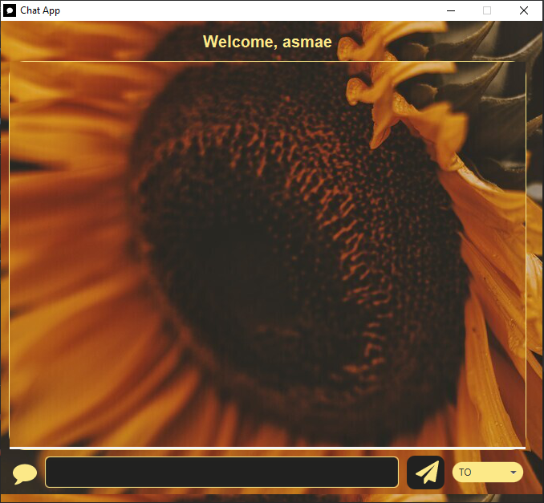

<h1>Multi Threads Blocking IO Chat app </h1>

  Asmae EL HYANI  Distributed System & Artificial Intelligence Master’s  ENSET Mohammedia

   
<h2>Description</h2>

I am excited to introduce my chat application, Asmae's chat,which utilizes Multi Threads Blocking IO for fast and efficient communication. This application provides a platform for sending and receiving text-based messages in real-time, and it's perfect for staying in touch with friends, family, and colleagues.

You need just to connect using your username, and then write the message, choose the recipient from the list, then send the message. 

    
<h4>Example of chat between tree users</h4>

You can found a video in my LinkedIn account

<a href="https://www.linkedin.com/posts/asmae-el-hyani-275086226_chat-linkedin-video-activity-7034952524637863936-UCGT?utm_source=share&utm_medium=member_desktop">Video</a>

I tried to make this chat using Multi Threads Blocking IO, I can use any other method with the same way.

